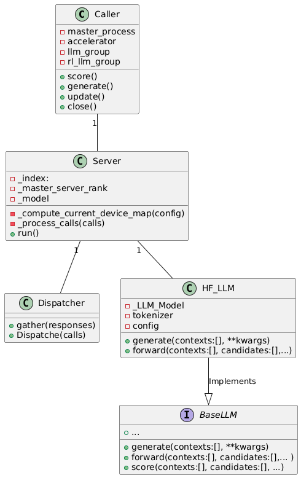
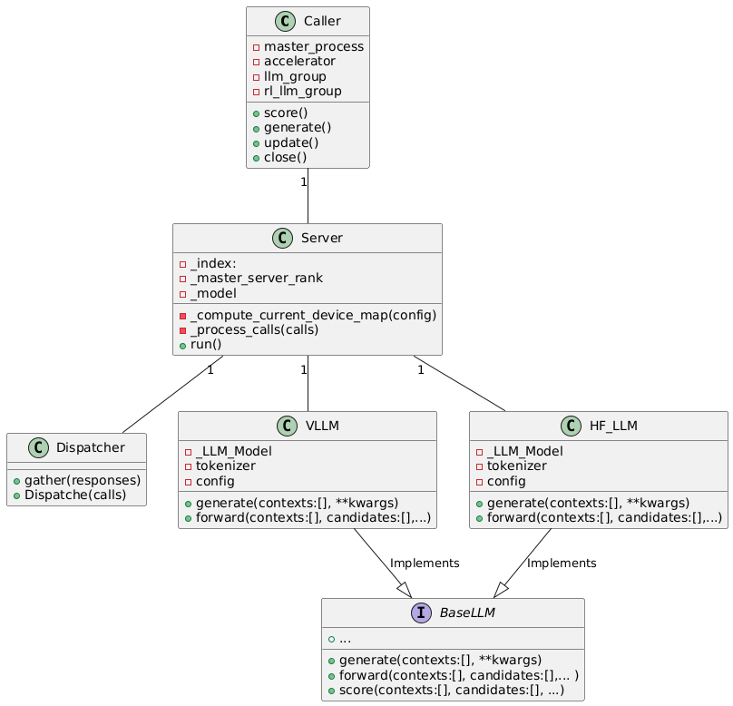

# VLLM integration 
This File documents the choices made to implment vllm integration in lamorel.


## Architecture choicess
here's the current architecture of Lamorel:




When integrating vLLM, lamorel uses vllm.LLM instead of a Hugging Face model. As a result, all Base_LLM methods delegate to the vLLM API.

We want to give users the ability to choose their preferred backend depending on their task — either **Transformers** or **vLLM**.

To support this, we considered three design approaches:

---

### 1. **Patching Methods Inside `HF_LLM`**

This approach involves implementing both versions of each method within the same class — for example:

- `transformers_generate()`
- `vllm_generate()`

While this keeps everything in one place, it quickly leads to a messy design and makes maintenance harder.

---

### 2. **Inheriting from `HF_LLM`**

Another idea was to create a new class that inherits from `HF_LLM` and overrides relevant methods to support vLLM.

However, after reviewing the vLLM documentation, we discarded this option:

- Even the **constructor** is entirely different.
- There is **no shared logic** between vLLM and Transformers that could be reused.

---

### 3. **A Separate Implementation of `Base_LLM`**

This approach consists of creating a new class that implements the `Base_LLM` interface, independently of the `HF_LLM` class.

It allows us to use a backend (like vLLM) that does **not rely on the Transformers implementation**, while still complying with the expected `Base_LLM` interface.

This design promotes clean separation between backends and avoids mixing concerns.

## Backend control:
to allow using vllm as a backend we need an attribute in the lamorel's conifg, so we added a bolean atttribute `use_vllm`:

```yaml
    lamorel_args:
      log_level: info
      gloo_timeout: 1800
      allow_subgraph_use_whith_gradient: false
      distributed_setup_args:
        n_rl_processes: 1
        n_llm_processes: 1
      use_vllm: true
      ...
```
In the server class, if use_vllm is passed to True we chose to instantiate the VLLM class instead of HF_LLM:

```python

    self._model = VLLM(config.llm_args, devices, use_cpu)  if config.use_vllm else  HF_LLM(config.llm_args, devices, use_cpu)

```

## Final architecture
The final design of lamorel's architecture 



## VLLM class: Implmentation details:

### 1 - Constructor


#### Platform Support

- **CPU Support Limitation**:  
  The `vllm` library does **not** provide pre-built CPU-compatible wheels. Users intending to run `vllm` on CPU must manually clone the [`vllm/vllm`](https://github.com/vllm-project/vllm) GitHub repository and build the wheel themselves.  
  Due to this limitation, **Lamorel only supports VLLM on GPU**. If `use_cpu=True` is passed to Lamorel, an exception is raised to indicate that CPU usage is not supported.

#### Model Type Support

- **Causal Language Models Only**:  
  VLLM only supports **causal language models**. Users should consult the [vllm/supportedModels](https://docs.vllm.ai/en/v0.10.1.1/models/supported_models.html#text-generation) VLLM repository to verify model compatibility.

#### Device Management

- **Device Configuration Behavior**:  
  The VLLM constructor `vllm.LLM()` does **not** accept a `device_id` parameter.  
  Instead, VLLM determines available devices based on the `CUDA_VISIBLE_DEVICES` environment variable. It will instantiate one model per device, according to the specified `tensor_parallel_size`.  
  Although Lamorel may pass a `devices` parameter to the constructor, this value is exported in `CUDA_VISIBLE_DEVICES`.


### 2 - generate()

```python
  def generate(self, contexts, return_logprobs: bool = False,**kwargs):
```

Lamorel adapts the `vllm.LLM.generate()` API to fit its internal logic and expected behavior.

#### Parameters

The `generate()` method in VLLM expects a `SamplingParams` object that controls decoding behavior.  
These parameters differ in naming and structure from the HuggingFace `transformers` API.

Lamorel assumes that the user is aware of the intended sampling parameters and constructs the `SamplingParams` object directly using the user-provided keyword arguments:

```python
sampling_params = SamplingParams(**sp_kwargs)
```

#### Special Parameter Handling

Some parameters require custom treatment within Lamorel to bridge the gap between Lamorel's API and VLLM's expected inputs.

---

##### **`num_return_sequences`**

- In Lamorel, `num_return_sequences` is used **outside** the `SamplingParams`, specifically within the dispatcher layer to manage LLM call distribution.
- If provided by the user, this parameter is internally **mapped** to the VLLM `SamplingParams` parameter `n`.

```python
if sp_kwargs.get("num_return_sequences"):
    sp_kwargs["n"] = sp_kwargs["num_return_sequences"]
```

---

##### **`return_logprobs`**

- To obtain log-probabilities of generated tokens, VLLM requires the `logprobs` parameter (an integer indicating the number of logprobs per token).
- Additionally, to get logprobs of the prompt tokens, Lamorel sets `prompt_logprobs`..

```python
sp_kwargs["logprobs"] = 1 if kwargs.get("logprobs") is None else kwargs["logprobs"]
sp_kwargs["prompt_logprobs"] = 0
```

- If `return_logprobs=False`, Lamorel will return the generated text along with the token probabilities (logprobs) as exp(log_prob)

---

#### Batching Behavior

The `vllm.generate()` method supports batched generation:  
A batch of contexts is passed to the model, and the method returns a corresponding batch of generated outputs.  
Lamorel integrates this batching behavior seamlessly when dispatching calls to VLLM-based backends.


### 3 - score()

Implements Lamorel’s `score()` method using the **VLLM backend**.

This function computes the **log-likelihood score** of candidate completions given a list of context prompts by estimating:

log P(candidate | context) = log P(context + candidate) - log P(context)

The method uses the `vllm.LLM.generate()` API and calculates token-level log-probabilities via `prompt_logprobs`.
NB: the vllm.score() provided by vllm.api is a `Samilarity` based score .

---

```python
    def score(self,  contexts, candidates, module_function_keys=[], require_grad=False, minibatch_size=None, **kwargs):
```

#### Scoring Logic

1. **Candidate Flattening & Tokenization Edge Case**  
   - Contexts ending with a space `" "` can cause tokenization mismatches between `context` and `context + candidate`.  
   - To ensure consistency, trailing spaces are stripped and a warning is logged.

2. **Prompt Construction**  
   - Full prompts (`context + candidate`) are built and flattened for batched inference.
   - Contexts are also flattened separately for later logprob subtraction.

3. **Logprob Calculation**  
   - Sampling parameters are updated to include:
     ```python
     sp["prompt_logprobs"] = 0
     sp["logprobs"] = 1
     ```
   - The model is called with `generate()` using full prompts.
   - Log-probabilities (`prompt_logprobs`) are summed, ignoring the BOS token.

4. **Context-Only Logprobs**  
   - Logprob of the context alone is computed by slicing the prompt logprobs (no second model call needed).
   - This avoids redundant forward passes.

5. **Conditional Log-Likelihood Computation**  
   - Final score is computed as:
     ```python
     log_p(candidate | context) = log_p(context + candidate) - log_p(context)
     ```
6. **Handling miniBatchsize**
   - flatten prompts  (`context + candidate`) are splited into batches of `mini_batch_size` size in order to avoid Out of memory issues.


### 4 - `forward()` Method

The `VLLM` backend does **not implement a `forward()` method**, as the `vllm` API does not expose such functionality.

#### Explanation

- The `vllm` library is designed around high-throughput **text generation**, and does **not provide access to internal model layers** or allow direct manipulation of the computation graph.
- As such, it **does not support standard forward passes** (e.g., outputting intermediate representations or hidden states), unlike traditional `transformers` models from HuggingFace.

#### Implication for Lamorel

- Any functionality that depends on a conventional `forward()` pass is **not supported** when using VLLM as a backend.
- Users needing access to logits, attention maps, or internal model activations should use a different backend that exposes these features (e.g., HuggingFace or DeepSpeed).


### 5 - Handling `module_functions`

Due to the limitations described in [Section 4 - `forward()`](#4---forward), the VLLM backend does **not** support applying `module_functions` (e.g., additional transformations, projections, or custom neural layers) on top of the model outputs.

#### Explanation

- `module_functions` in Lamorel are typically applied to intermediate representations obtained via a standard `forward()` pass.
- Since the `vllm` API does **not expose internal layers** or allow direct access to hidden states, these functions **cannot be applied** in the VLLM workflow.
- As a result, any module logic (e.g., linear heads, adapters, classifiers) is **skipped** when using the VLLM backend.

## Limitations


- Handling module_functions presents a current limitation of the VLLM integration.  
Support for `module_functions` will require future extensions either in Lamorel or new features in the VLLM library to expose deeper model internals.

- Since the vllm doesn't give the possibility to train the model the update function cant implemented on a vllm model.

## Test
in order to test the class VLLM

1 - create a conda environnement containing lamorel dependecies + vllm==0.10.1

NB: vllm==0.10.1 requires a Transformers>=4.56, we recommend the user to have two separate envoronment, 
(one for use_vllm=true with vllm==0.10.1 requires and Transformers>=4.56 ) and ( a second one for use_vllm=false with transformers==4.46)  


2 - run `test_vllm.py` besides the file (vllm.py)
```bash
python test_vllm.py --model facebook/opt-125m --dtype float16
```

